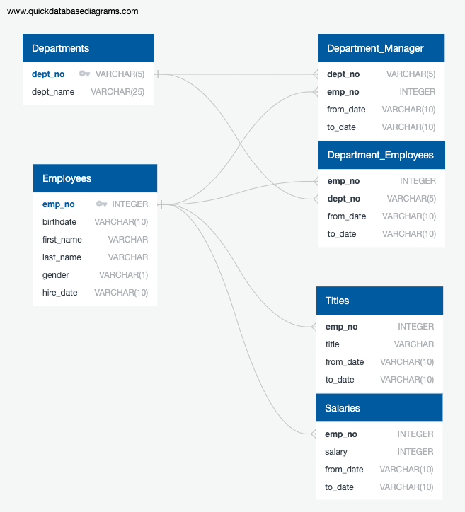

# SQL-Challenge: An Unknown Company

We are posed with the challenge of creating the schema and tables for six given csv's and analyzing their contents. We are given the department and employee information for a small company. Using the information given, we created a database with the following relations:

The two defining tables are `Departments` and `Employees`. All other tables are children to these master tables using either `dept_no` or `emp_no` as the foreign key in their schema.

We were asked multiple questions about the database. My numeric answers are as follows:
1. 36150 were hired in the year 1986.
2. There are 20 people named "Hercules" with a last name starting with a "B".
3. 52245 people have been or are currently in the Sales Department.
4. 137952 people have been or are currently in the Sales and Development Departments.
5. "Baba" is a very common last name.

Looking back on the database, I would have changed the dates into actual PostgreSQL date objects, but the conversion is not that difficult.

Included in `EmployeeSQL` are the files:
- `schema.sql`
- `query.sql`
- `data-ERD.txt` and `data-ERD.png`
